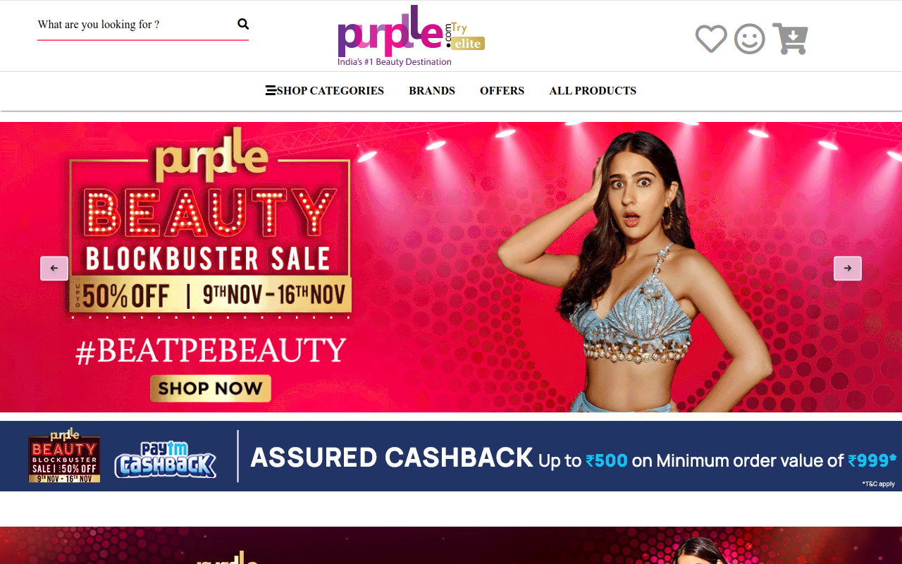

# Purplle

Ecommerce is designed truly based on basic languages HTML, CSS, and Javascript only.

You Can Add dummy data using the file "AddData.html"
After opening the file in browser just click on the button and dummy data will be added to your localStorage

# Features Available
<ul>
<li>User can signup and signin easily.</li> 
<li>User can add any product to cart and can move to payment page</li> 
<li>User can also add product to wishlist and can buy it later.</li> 
<li>User can view any product according to the brand also.</li> 
<li>User can also view all product of any type or subtype.</li>
</ul>

# Admin
<ul>
<li>Most of the part in the website is dynamic.</li> 
<li>Navbar is totally dynamic , Admin can add more category , type and subtype</li> 
<li>Admin can add brands</li> 
<li>Admin can add products of certain brand ,type , or subtype</li> 
<li>Admin can also add offers to a product.</li> 
</ul>
